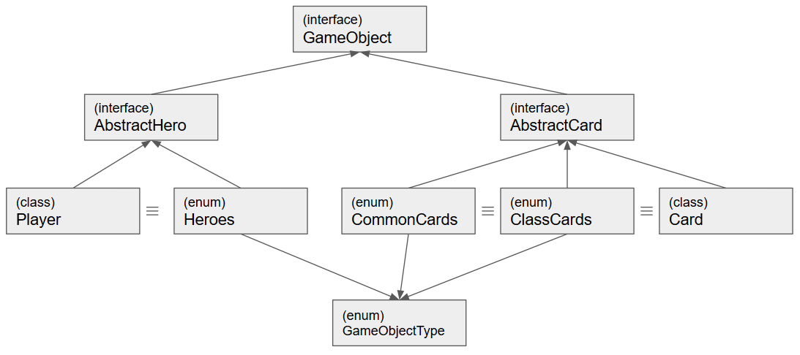
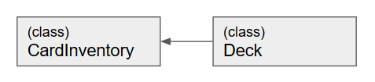
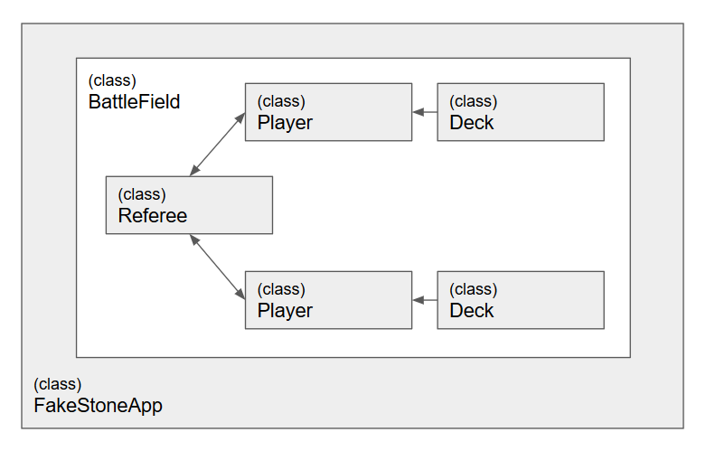

# 유사 하스스톤(Hearth Stone)

## 개요

하스스톤과 같은 규칙의 게임을 JAVA로 작성합니다.  
게임의 내용이 방대하므로 주요한 규칙과 직업을 선별하여 적용합니다.  
me.idpravus 패키지의 Main.java로 실행 가능합니다.

## 규칙

### 게임 규칙

- 플레이어 1, 2가 순차적으로 콘솔을 이용하여 입출력을 합니다. 
- 9개의 직업 (전사, 주술사, 도적, 성기사, 사냥꾼, 드루이드, 흑마법사, 마법사, 사제)이 있습니다.
- 각자 30장의 카드를 조합하여 덱을 구성합니다. 플레이어는 30의 체력을 갖고 있고 직업에 따라 특수기술을 사용할 수 있습니다.
- 시작하면 선, 후공이 무작위로 결정되고 선공은 카드 3장, 후공은 카드 3장과 행동력(마나)을 한 번 1 증가시켜주는 동전 한 닢 카드를 받습니다.
- 각 턴의 제한시간은 75초이고 턴이 다시 돌아올 때마다 카드를 1장씩 받고 행동력(마나)이 1씩 늘어납니다. 제한시간이 끝나기전 턴을 넘길 수 있습니다.
- 카드의 종류는 하수인, 주문, 무기 카드가 있습니다. 각 카드는 공격력과 방어력을 보유하고 있습니다. 소환된 다음 턴 부터 상대를 공격 할 수 있습니다.
- 선공의 턴이 46턴째에 접어들면 무승부로 게임이 끝나게 됩니다.

### 구현을 위해 변경한 규칙

1. 공통카드는 최초 발매시 기본등급이었던 44장, 직업별 카드는 직업별로 6장 정도씩만 생성합니다.
1. 하수인 카드만 구현하고 주문, 무기카드는 인터페이스 수준까지만 목표로 합니다.
1. 카드 특수능력은 도발을 우선적으로 구현합니다.
1. 턴의 제한시간은 없애고, 45턴 후 무승부는 적용합니다.

### 아직 완성하지 못한 부분

1. 첫 턴에 받은 카드는 교환가능 하다
1. 후공이 받는 동전 한 닢 카드
1. 플레이어 항복 선언

## 주요 객체

- 플레이어(Player)
  - 처음 세 장(혹은 네 장)의 카드를 받고, 턴마다 한 장씩 카드를 받아 Hand에 보유한다
  - 자신의 턴이되면 마나에 맞춰 카드를 내거나, 영웅 특수능력을 쓸 수 있다.
  - 초기 체력은 30이고 0이 되면 패배한다
  - 중도에 항복 가능하다
  - 첫 턴의 총 마나량은 1이고 돌아오는 턴 마다 1씩 늘어나며 10을 초과하지 않는다.
  
- 직업(Hero)
  - 9가지 직업이 있고 각자 고유능력을 사용할 수 있다.
  - 클래스 고유카드는 해당하는 클래스만 쓸 수 있다.
  - 특정 클래스는 무기카드를 장비할 수 있다
  
- 카드뭉치(Card Inventory)
  - 덱을 구성하기전의 전체 카드목록 (플레이어가 보유한 전체 카드)
  
- 덱(Deck)
  - 덱은 플레이어가 게임시작 전 30장까지 구성 가능하다.
  - 게임이 시작되면 플레이어는 임의의 카드뭉치를 받으며, 덱의 상태는 알지 못한다
  
- 카드(Card)
  - 공통카드와 클래스 전용카드가 있다
  - 이름이 있다
  - 마나소모량(cost)은 1~8까지 존재한다
  - 특수능력 (도발)을 보유한 카드가 있다
  - 각자 공격력과 방어력이 있다
  - 특수능력 (돌진)이 없으면 소환된 다음턴부터 사용 가능하다
  - 공격 대상을 지정할 수 있다
  - 상대의 필드에 도발카드가 있으면 도발 하수인을 우선 공격해야 한다
  
- 카드 데이터 형식(틀) (CommonCards, ClassCards)
  - 카드에 명시되어야 할 데이터를 정의
  
- 공통규칙 (Rule)
  - 각 플레이어당 턴수는 45턴씩
  - 임의로 선, 후공이 정해지고 후공 플레이어에게는 동전 한 닢 카드 한 장이 주어진다
  
- 전장(Battle Field)
  - 게임을 진행하는 역할을 한다
  - 게임에 놓이는 객체(플레이어, 덱, 필드에 놓인 카드)의 존재를 알고있고 요청이 있으면 이를 알려준다
  - 턴을 관리하고, 승리자가 생기면 게임을 종료시킨다

- 심판(Referee)
  - 각 플레이어들이 어떤 행동을 할 수 있는지 판단하고 알려주는 가상의 심판을 생성한다
  - 플레이어들이 요청한 행동 (공격, 스킬사용)에 대한 결과를 계산하고 이를 각 플레이어와 진행자(전장)에게 알려준다  

### 객체를 연결한 게임 실제 구현

#### 상속구조 도표

게임에서 전장(Battle Field)과 심판을 제외한 다른 객체들은 최상위 인터페이스 GameObject를 구현합니다.  
기본적으로 게임내에서 상호작용이 있고, 구현시 객체들간의 공/방 상황을 유연하게 처리하기 위함입니다.  
또한 GameObject를 상속받은 AbstractHero와 AbstractCard는, Enum과 Class를 통해 구현됩니다.
일례로, CommonCards(enum)과 Card(class)는 동시에 AbstractCard를 구현하는데 이를 통해 데이터(실체)와 객체(추상)가 논리적 동등성을 확보하게 됩니다.

#### 구상 클래스 상속

CardInventory는 플레이어가 보유한 전체 카드목록을 갖고 보여줍니다. 하지만 게임에 사용되는 카드는 30장이기 때문에 게임시작전 각 플레이어들은 덱에 카드를 30장씩만 골라서 넣어야 합니다. 기본적인 틀을 유지한 상태에서 덱이 추가적인 기능을 구현하기 때문에 CardInventory를 상속합니다.

### 게임 진행순서

게임을 구동하는 FakeStoneApp은 각 객체들을 생성하고 보유하는 일종의 Container 역할입니다.  
플레이어 설정을 마치고 나면 BattleField를 생성하여 게임을 시작합니다.

BattleField에서는 승리조건을 만족하기 전까지 GameLoop를 가동하고, 심판-플레이어-덱 간의 상호작용으로 게임을 진행하게 됩니다.

## 후기

많은 시간이 없어 급한마음에 구조를 짠 뒤 시작한 상황이어서 구현이 진행될 수록 문제점에 가속이 붙는다는 느낌이 들었습니다.  
객체지향언어를 쓰면서 매번 나누는게 class였지만, 실상 설계시에 추상객체의 경계를 칼로 자르듯 긋는게 쉽지 않음을 느꼈습니다.  
콘솔로 입출력을 처리하다보니 logic과 view가 명확히 분리되지 않아서 소스가 복잡해지는 문제도 해결하기 어려웠습니다.